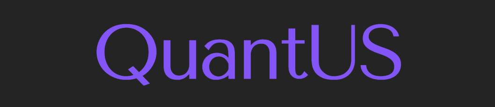

<p align="center">
  
</p>

#

QuantUS is an open-source quantitative analysis tool designed for ultrasonic tissue characterization and contrast enhanced imaging analysis. This software provides an ultrasound system-independent platform for standardized, interactive, and scalable quantitative ultrasound research. QuantUS follows a two-tier architecture that separates core functionality in its backend engines from user interaction support in the frontend. The software is compatible on Mac OS X, Windows, and Linux.

Currently developed backends support quantitative ultrasound (QUS) backscatter analysis and dynamic contrast-enhanced ultrasound (CEUS) perfusion imaging analysis in both 2D and 3D. However, the plugin-based architecture allows for easy extension to additional QUS methods and analysis types in the future.

Note that the GUI in this repository is incomplete. Specifically, the CEUS GUI only supports manual segmentation (i.e. no viewing of pre-existing segmentations, no analysis, no visualizations). Please refer to the legacy version of the QuantUS GUI for more complete frontend support. More information about each backend can be found in their respective repositories. Also, support for batch processing is exclusively supported in the backend repositories at this time.

## Installation

To clone this repository, run

```shell
git clone --recurse-submodules https://github.com/QuantUS-OpenSource/QuantUS.git
```

To set up the Python virtual environment and install dependencies to run QuantUS, run the following commands. Let `PYTHON311` be the path to your Python3.11 interpreter. Note that if you are using Windows, the pyradiomics install below may fail without an additional installation (more on this below).

```shell
cd QuantUS
$PYTHON311 -m pip install virtualenv
$PYTHON311 -m virtualenv .venv
source .venv/bin/activate                           # Unix
.venv\Scripts\activate                              # Windows (cmd)
pip install --upgrade pip setuptools wheel
pip install numpy
pip install -r requirements.txt
pip install pyradiomics==3.0.1 --no-build-isolation
./saveQt.sh                                         # Unix
.\saveQt.sh                                         # Windows (cmd)
``` 

To run the GUI, use

```shell
source .venv/bin/activate                           # Unix
.venv\Scripts\activate                              # Windows (cmd)
python qus_gui.py | ceus_gui.py                     # Run QUS or CEUS GUI
```

### Note for Windows users

If you encounter an error during the pyradiomics install above, you will need to first install Microsoft C++ Build Tools, which can be found here: https://visualstudio.microsoft.com/visual-cpp-build-tools/

### Keeping your version up to date

To keep your local copy of all QuantUS backends up to date, run the following commands from the root `QuantUS` directory to update all backends to their latest versions:

```shell
git submodule update --remote --merge
```

